###  General Assembly, Software Engineering Immersive

# Booked-Up

by [Jamie Maxwell](https://github.com/Jamie66m), [Peter Gilbert](https://github.com/PeteG-cmd), [Gordon Gyakyi](https://github.com/Intravenous)

<p align="center">
  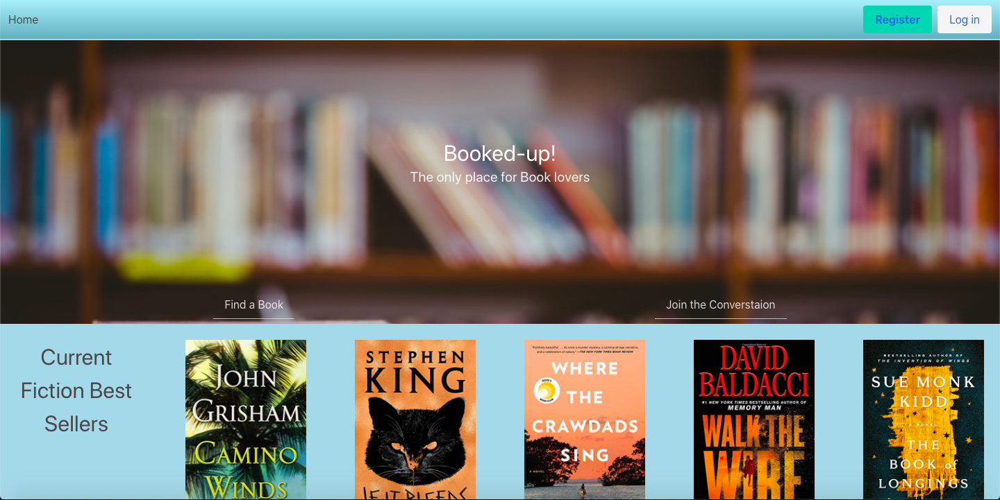
</p>

## Overview

Booked Up is the third project that we completed during our Software Engineering Immersive at General Assembly. It is a MERN stack web application allowing book lovers to search through thousands of books, create their own library and discuss these books in virtual book clubs. 

This project was completed by a group of 3 and we were given just over a week to complete the project. At the beginning we knew that we really wanted to offer the user the ability of being able to communicate with other users and discuss books they have read or just have a general conversation about their love for reading. The most important aspect of the project that we wanted to get right was creating a journey for the user through the site and giving a quality UX. 

The books displayed to the user come from two external APIs, Google Books API and NY Times API. We would only store the books in the database that the user added to their library in order to improve performance. 

Check out Booked-Up on [Heroku](https://booked-up.herokuapp.com/), or find the GitHub repo [here](https://github.com/PeteG-cmd/project-3)

#### Please note

This project was made to be viewed on a laptop. Due to time restrictions, it is not yet mobile responsive. All form fields are required on registration to create an account.


## Table of contents
1. [Brief](#Brief)
2. [Technologies used](#Technologies-used)
3. [Approach](#Approach)
    - [Planning](#Planning)
    - [Wireframes](#Wireframes)
    - [Back-end](#Back-end)
    - [Front-end](#Front-end)
4. [Screenshots](#Screenshots)
5. [Winners](#Winners)
6. [Challengers](#Challengers)
7. [Future features](#Future-features)
8. [Lessons learned](#Lessons-learned)

## Brief

* Work in a team, using **git to code collaboratively**.
* **Build a full-stack application** by making the backend and the front-end
* **Use an Express API** to serve data from a Mongo database
* **Consume the API with a separate front-end** built with React
* **Be a complete product** which most likely means multiple relationships and CRUD functionality for at least a couple of models

## Technologies Used

| Category | List |
| ---- | --- |
| Languages                            | Javascript (ECMAScript6), CSS3, Sass, HTML5 |
| Front-end Web Application Framework  | React.js |
| Server Environment                   | Express |
| Database                             | MongoDB and Mongoose|
| REST client                          | Insomnia |
| CSS Framework                        | Bulma |
| Libraries                            | Slick Carousel, Moment, React-Loader, Multer
| Typefaces                            | Font Awesome |
| Text Editor                          | VS Code |
| Browser                              | Chrome |
| Version control | Git and GitHub


## Approach

## Planning

We quickly came to the decision that we wanted to create a Book Club app. The next thing we discussed was what API's to use and we needed one's that were going to help us achieve some of the features we wanted to implement. The NY Times API we knew would be great for displaying the books from a category a user had chosen and the Google Books API provided us with so many books and end points that we knew we could gather all the necessary information to display to the user when deciding to add a book to the library and thus to the database.

After this initial step we moved onto drawing out the layout and writing up the models and the endpoints we would need. We tried to put ourselves in the shoes of the user to imagine what they would want on their profile and how they would want to interact with the site and what they would want to get out of the site.

We decided that it would be best when working on a specific feature to set up the backend and create a front end at the same time as we felt this would be the most efficient and effective way of working on the project as we wanted to be able to see the immediate results.

<p align="center">
  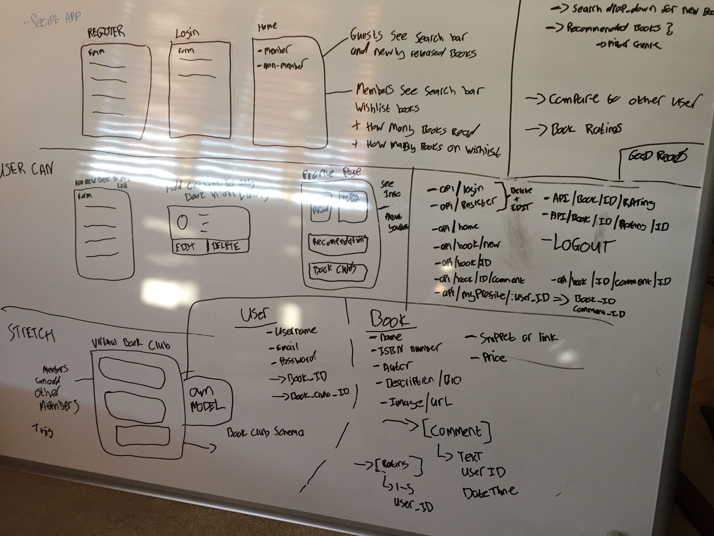
</p>

## Wireframes

Several wireframes were put together on a site called MockFlow.

#### Homepage

<p align="center">
  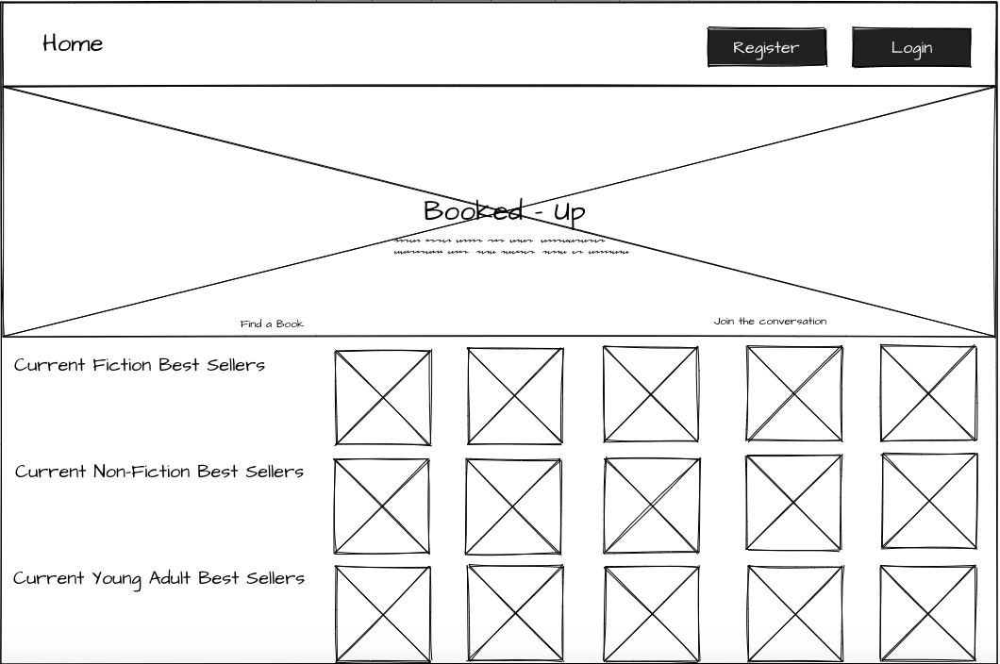
</p>


#### User Home

<p align="center">
  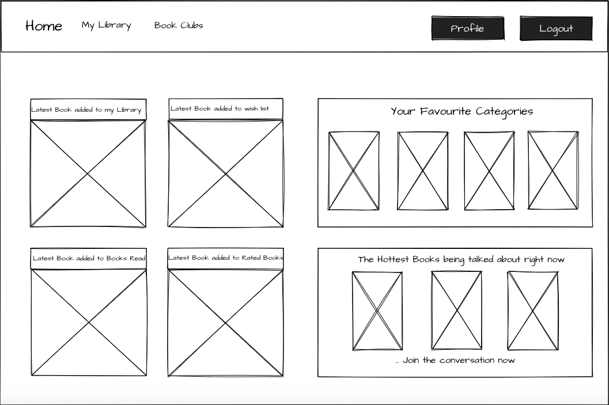
</p>

#### User Profile

<p align="center">
  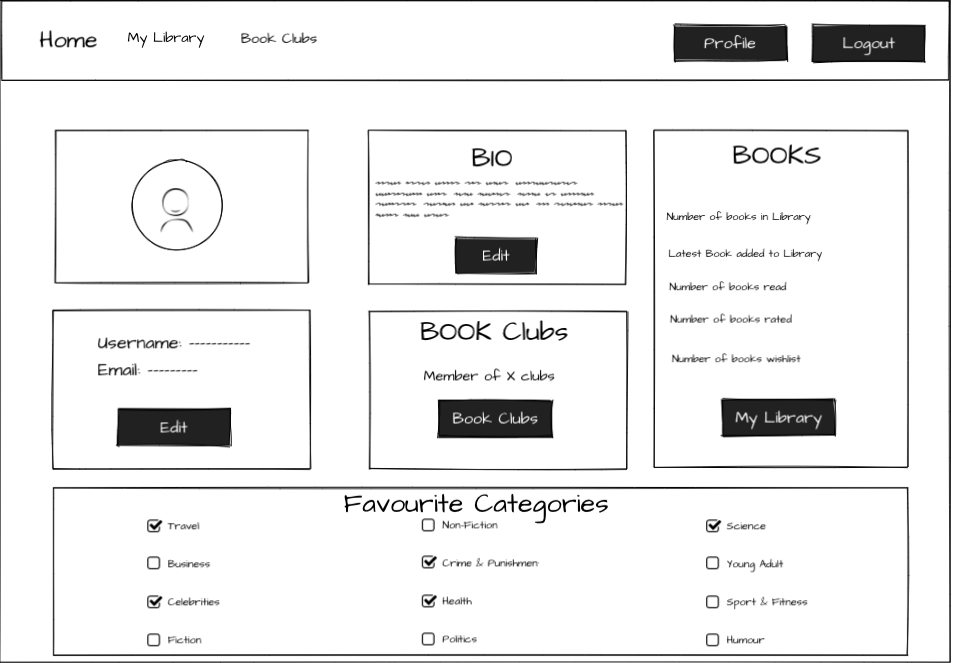
</p>


#### Book Club

<p align="center">
  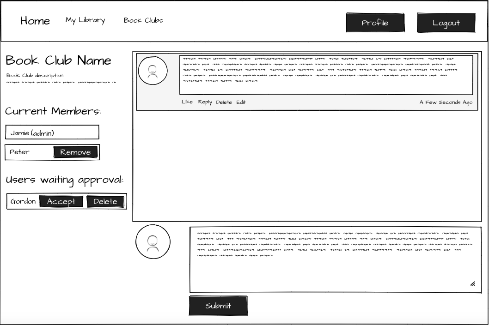
</p>

#### Detailed Book Page

<p align="center">
  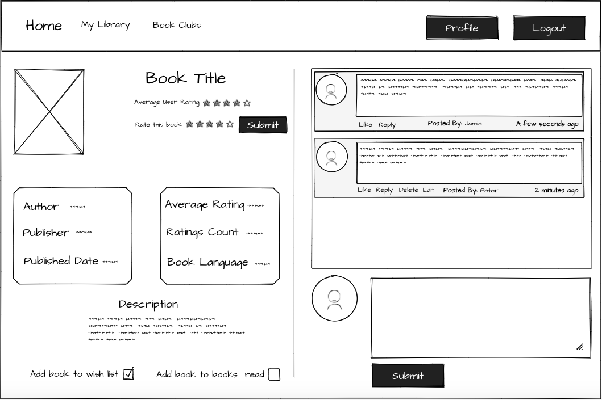
</p>


## Front-end

The front end of the application was built using a number of React components. In total we had 17 components.

#### Home
The logged-out home screen presented the user with register and login buttons. Added to this, the user was also presented with a number of carousels, showing books with data served from the NY Times best-seller lists.

#### User Profile and categories
One of the components that I worked on heavily was the UserProfile.js.
This component took information from two of our API endpoints and used tokenisation to ensure that the data returned, only related to the user that was logged in.
```js
  componentDidMount() {
    axios.get('/api/mylibrary', { headers: { Authorization: `Bearer ${auth.getToken()}` } })
      .then(res => this.setState({ books: res.data.books }))
      .catch(err => this.setState({ error: err.response.data.message }))
    axios.post('/api/profile', {}, { headers: { Authorization: `Bearer ${auth.getToken()}` } })
      .then(res => {
        console.log(res.data)
        if (res.data.image[0]) {
          res.data.image[0].imageData = res.data.image[0].imageData.split('/')[2] 
        }
```
The information presented on this page, related to the users account. For instance, the number of books they had read or the number of books on their Wishlist.  It also allowed a user to be able to change and amend information related to their account. For example, the category information that a user had selected on registering for the site, could be changed here, if required.
The code below mapped through the existing category data, in order display the existing categories on the profile.
```js
        //Maps thru existing categories data to populate categories on user profile
        this.setState({ user: res.data })
        console.log(this.state.user)
        const categories = res.data.categories.map((category, index) => {
          return category.category
        })
        this.setState({ categories: categories })
      })
  }
```
After being presented with the data, a user was then able to amend the data. The amendments would be captured by a handleChange function, stored in a new variable and posted to the 'api/categories' endpoint.
```js
<label className="checkbox">
                  <input
                    onChange={(event) => this.handleChange(event)}
                    type="checkbox"
                    value="advice-how-to-and-miscellaneous"
                    checked={this.state.categories.includes('advice-how-to-and-miscellaneous') ? true : false}
                  />
                  Advice and How To
                </label>
                <label className="checkbox">
                  <input
                    onChange={(event) => this.handleChange(event)}
                    type="checkbox"
                    value="animals"
                    checked={this.state.categories.includes('animals') ? true : false}
                  />
```

#### Slick Carousel 

We added the slick carousel feature in two areas of the application and these can been seen on the main home page and the user home. However, having just images just planted on the page we knew that we had to bring some relevance to the books being displayed. The slick carousels on the main home page are displaying books from the NY Times API and the slick carousel on the user home is displaying the books from the chosen categories by the user at registration with also the NY Times API. 

Whether you were clicking on a book on the home page or the user home we wanted to either redirect the user to the single book page of that particular book or take them through to the search book page where we would display books with similar titles. When we displayed a book on the single book page or when a user would search a book this would be done by using a GET request from the Google Books API. However, a great challenge was being able to click on a category book on the user home or a book on the main homepage which was displayed by the NY Times API and either redirect the user to the single book page and show all the information that we were requesting or if the Google Books API didn't have the book, then we would redirect the user to the search book page and on the `componentDidMount()` method we would match the title of the book from the NY Times API with the Google Books API to then display books with a similar title. 

This was a great problem solved by Peter

```js
  handleClick(book) {
    console.log(book)
    axios.get(`https://www.googleapis.com/books/v1/volumes?q=isbn:${book.primary_isbn13}`)
      .then(res => {
        if (!(res.data.items)) return this.setState({ searchRedirect: { title: book.title } })
        if (res.data.items[0].volumeInfo.title.toLowerCase() !== book.title.toLowerCase()) return this.setState({ searchRedirect: { title: book.title } })
        const linkTo = res.data.items[0].id
        this.setState({ redirect: linkTo, bookClicked: res.data.items[0] })

      })

      .catch(error => console.error(error))
  }
```

```js 
    const webId = this.state.redirect
    const titleForDirect = this.state.searchRedirect
    if (this.state.redirect) return <Redirect to={{ pathname: `/book/${webId}`, state: { book: this.state.bookClicked } }} />
    if (this.state.searchRedirect) return <Redirect to={{ pathname: `/books/new/${titleForDirect.title}`, state: { book: this.state.bookClicked } }} />
    if (this.state.bookList.length === 0) return <div className="CarouselSpinner"><CarouselSpinner /></div>
```
As you see above, depending on what state was true we would then redirect them to the necessary page. To redirect the user to the single book page we had to pass through the book id and but to make sure that the book was correct we used the `primary_isbn13` number. If the user was redirected to the search book page we would pass through the title in order that we could then match in the `{SearchNewBooks}` component.


#### Single Book

The Single Book component is where a user would then add a book to their library and we would store the book in the backend with all the necessary information so that when we used a GET request to get those books we could then display the information of that book on the users library page. We did come across an asynchronus issue prior to the decision of passing through some of the book information to the database when trying to search for a book in the users library. Originally we would display the books from the database that the user had added to the library still using the Google Books API. However, when it came to searching the books we came across a number of issues and so we thought it would be best to just make sure that we stored the right information of the book in the database and so we could then run an easy search in the user library.

```js
  constructor() {
    super()
    this.state = {
      book: null,
      submitDetails: {
        webId: '',
        title: '',
        isbnNumber: '',
        author: '',
        thumbnail: '',
        pageCount: Number,
        language: '',
        categories: ''
      }
    }
  }
```

```js
  handleSubmit(event) {
    event.preventDefault()
    axios.post('/api/myLibrary', this.state.submitDetails, { headers: { Authorization: `Bearer ${auth.getToken()}` } })
      .then(res => {
        this.props.history.push('/mylibrary')
      })
      .catch(err => this.setState({ error: err.response.data.message }))
  }

  updateDetails(data) {

    const neededIsbn = []
    data.volumeInfo.industryIdentifiers.map(isbn => {
      neededIsbn.push(isbn.identifier)
    })

    neededIsbn.sort()
    console.log(neededIsbn)
    neededIsbn.shift()
    console.log(neededIsbn)


    const submitDetails = {
      webId: data.id,
      title: data.volumeInfo.title,
      isbnNumber: neededIsbn[0],
      author: data.volumeInfo.authors[0],
      thumbnail: data.volumeInfo.imageLinks.thumbnail,
      pageCount: data.volumeInfo.pageCount,
      language: data.volumeInfo.language,
      categories: data.volumeInfo.categories[0]
    }
    this.setState({ submitDetails })
  }
```


#### Hottest Books

To show users that there was interaction on the site and to be keen to join in the conversation we thought that it would be a nice feature to display the most recent books that had been commented on.

```js
 axios.get('/api/books/get')
   .then(res => 
     const books = res.data
     let hotBooks = books.filter(book => {
       return book.comments.length > 0
     })
     hotBooks = _.shuffle(hotBooks)
     this.setState({ hotBooks  
   })
   .catch(err => this.setState({ error: err.response.data.message }))
```

```js 
  {this.state.hotBooks.length > 2 && <div className="HomeCommentsImages">
   <Link to={`/book/${this.state.hotBooks[0].webId}`} book={this.sthotBooks[0]}>src={this.  state.hotBooks[0].thumbnail} alt=""></imLink>
   <Link to={`/book/${this.state.hotBooks[1].webId}`} book={this.sthotBooks[1]}>src={this.  state.hotBooks[1].thumbnail} alt=""></imLink>
   <Link to={`/book/${this.state.hotBooks[2].webId}`} book={this.sthotBooks[2]}>src={this.  state.hotBooks[2].thumbnail} alt=""></imLi
  </div>}
```

It was important to have checks on this just incase there were no comments on any books but we would filter through the books in the database and then when we would render the `{Home}` component we would show the 3 most recent commented books.

#### Comments


## Screenshots

#### Homepage

<p align="center">
  
</p>

#### User Home

<p align="center">
  
</p>

#### User Profile

<p align="center">
  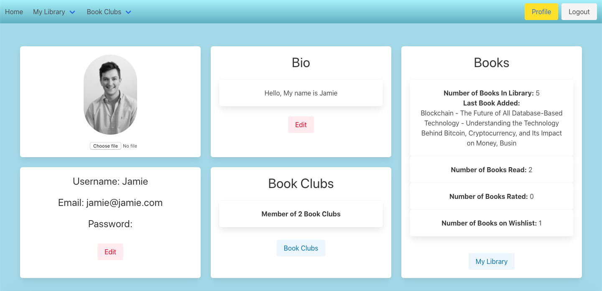
</p>

<p align="center">
  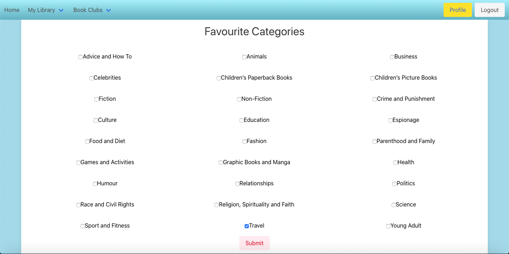
</p>


#### Searching Books

<p align="center">
  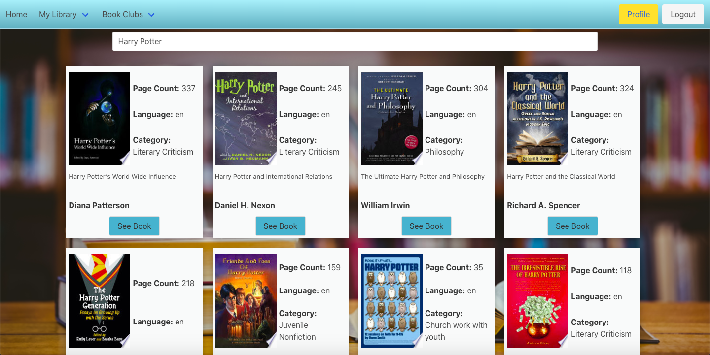
</p>


#### Single Book

<p align="center">
  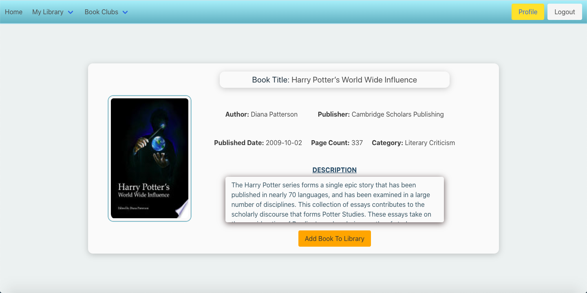
</p>

#### User Library

<p align="center">
  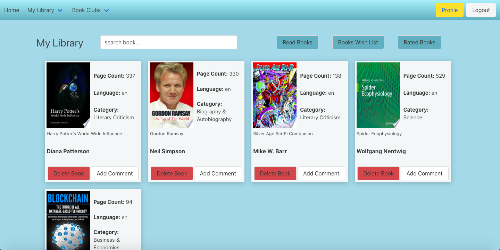
</p>

#### Detailed Book Page with comments

<p align="center">
  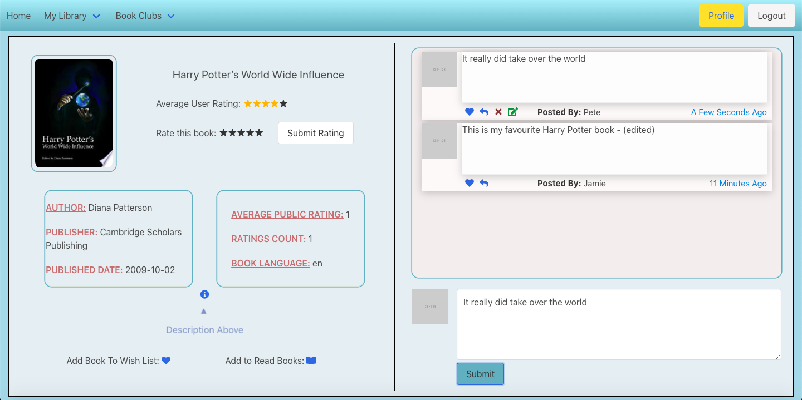
</p>

#### BookClub with user waiting approval

<p align="center">
  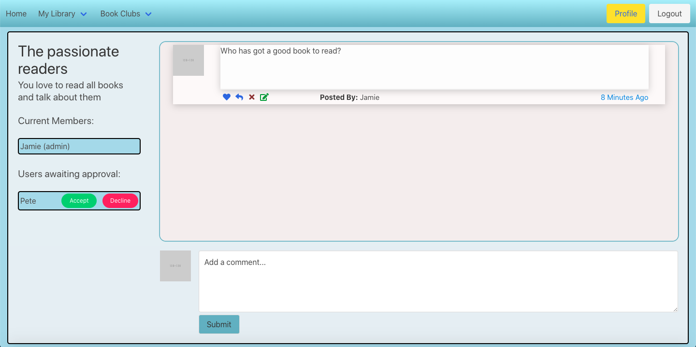
</p>

 
## Challenges
* The logic required to show previously selected user categories, on the profile page, was a challenge. Although the categories on the profile page enabled you to change your selections, for it to be user friendly, it needed to show you what you had already selected when you first registered. The mapping solution worked well in the end, however, given more time, I would have liked to have refactored the original category code. Removing the 'hard-coded' elements of the initial category code, I think would have made the process of displaying and updating the categories on the profile page easier.
 
 ## Successes 
* Working successfully in a team and using Git and GitHub as the means of controlling our workflow was a big success.  It's not something that I had ever done before and although the merge process could sometimes be tricky, it was good to get practise using it.
* A second success was being able to integrate a backend into a project.  Having our own API meant we were able to do more with a logged-in user than had previously been the case.
## Potential Future Feature
* Improving some of the aspects of the UX would be a future feature to incorporate as currently, it's not always obvious how a user can access some of the important functionality of the site. For example, adding a book to a Wishlist or marking it as read, can only be done when you try to add a comment for a book.  It would be good if this could be done directly from the library or when you look at the detail of a book, rather than just when you add a comment to a book.
## Lessons Learned
* That although Git and GitHub are great tools for managing the coding workflow, you still need to ensure that you communicate with your team outside of these tools. Failure to do this, can lead to issues that could otherwise have been easily avoided.
